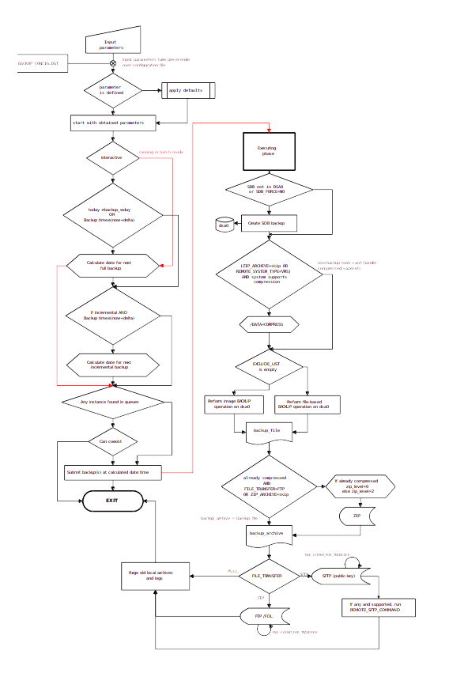

Title: OpenVMS system disk backup
status: published
Location: Santander, ES
Tags: OpenVMS

##Wrapper for doing automatic backups of the system unit (DSA0:) in OpenVMS

In a nutshell:

- It assumes that OS is installed in `DSA0:` unit.
- This script is basically invoking the OpenVMS' `backup` command.
- The resulting file is always stored locally (where configured) and transferred
via s/FTP to a remote SAN.
- Full and incremental/daily backups can be done.
- Script takes care of housekeeping according to configured values.

##OpenVMS system disk backup
In order to safeguard against loss or corruption of relevant information of the
system, or to periodically archive copies of the most important (configuration)
files, a backup of the data is needed. The resulting archives may be used to
recover the original information after a disaster (for example if system disk is
damaged), or to restore data from an earlier time.

OpenVMS provides several ways to backup files, being the embedded backup tool
the most powerful and widely used. Using this tool an operator can:

- Make image backups of a unit (snapshots of the whole content of a disk
volume). In the case of the system unit, the bootstrap data is saved in the
archive.
- Make file based backups (archive of selected folders and files). No bootstrap
data is usually saved in file based backups.
- Optionally a DB backup (Oracle RDB or Mimer) will be done online into a file
saved in system unit (inside `DSA0:[BACKUP]` folder). In some systems, this DB
already resides in the system unit and this step is not necessary (but may be
forced).
- No other data is backed up.

In order to speed the process up and minimize the impact on size and bandwidth
needed to store and transfer the resulting archives into the data warehouse,
it is recommended to keep the system unit clean.

The procedure described in the following chapters defines how to make a backup
of the system volume to a separate disk, and how to roll back in case of the
system disk needs to be restored to a previous state.
In the following examples, a full backup of the system volume to the spare SAS
disk `DKA200` is done, together with it an online backup of the database.

> **<u>NOTE</u>:** The spare disk available for the backup might be different
from `DKA200` as used for the examples. Please adjust according to your system’s
configuration.

Later on, the opposite operation for restoring data from a backup archive will
be described, as well as some troubleshooting guidelines on booting from a
minimal OpenVMS unit (referred to as emergency boot).

> **IMPORTANT**: The backup procedures are to be executed with the same user
(i.e. SYSTEM) as specified for each command.

#1. Preparations

##1.1 Prepare target disk

The target disk can be either one of the local SAS disks on each node or a
shared disk from the SAN. If the target disk is not bootable, proceed as
follows. It is also possible to use a **LD device** as destination.

Initialize the disk and make it bootable (will delete all its contents!).
Do not use any reserve word as system label (i.e. `backup` or any other known
command). Refer to **Troubleshooting** chapter for further details.

Destination volume must be initialized and mounted:

- Alpha:

        :::factor
        SYSTEM> INITIALIZE /NOHIGH/cluster=16/extension=256/header=8000 DKA200: BCK_DSK
        SYSTEM> MOUNT /OVERRIDE=IDENTIFICATION DKA200
        SYSTEM> @SYS$SYSTEM:AXPVMS$PCSI_INSTALL_MIN
        Enter device name for target disk: (? for choices) DKA200
        Do you want to create or validate boot options? (Yes/No) Yes        

- Itanium:

        :::factor
        SYSTEM> INITIALIZE /NOHIGH/cluster=64/extension=256/header=8000 DKA200: BCK_DSK
        SYSTEM> MOUNT /OVERRIDE=IDENTIFICATION DKA200
        SYSTEM> @SYS$SYSTEM:I64VMS$PCSI_INSTALL_MIN
        Enter device name for target disk: (? for choices) DKA200
        Do you want to create or validate boot options? (Yes/No) Yes

If the destination disk is labeled `BCK_DSK`, the script will automatically put
the backup archives inside a `BACKUP` directory in it. This is the easiest way
to proceed when working with local disks: units should have the same name from
every node in the cluster, even if they are not labeled or identified the same
(for example, disks located in different bay numbers will get different naming).

If there is an already initialized unit in place, this same behaviour can be
achieved by setting a logical name pointing to its label.

This logical name definition may be added to `sys$startup:sylogicals.com` file.

The logical must be defined **on each node in the cluster**. It is very
important to use the translation_attribute qualifier as well as the ending ':'
sign in the target unit. For example:

    :::factor
    SYSTEM> define /translation_attributes=conceal /system /exec BCK_DSK DAT0:

Finally, copy the ZIP and UNZIP binaries to the emergency disk as follows:

    :::factor
    SYSTEM> copy /log *ZIP.EXE DKA200:[000000]

> **<u>Note</u>:** doublecheck that the versions of ZIP and UNZIP are supported as
explained in 1.3.

##1.2 System disk cleanup

To speed up the overall process, it is recommended to first clean up the system
disk by purging unnecessary files. As an example, purge files with extension
log or tmp older than one week and look for files larger than 100000 blocks
(5 MB):

    :::factor
    SYSTEM> purge /log dsa0:[000000...]*.log,*.tmp /keep=7
    SYSTEM> MC DFU search /size=minimum=10000 dsa0

You may also set some backups which don't need to be backed up with the
following command:

    :::factor
    SYSTEM> set file /nobackup sys$system:pagefile.sys

##1.3 Required third-party tools

Verify on the system that the ZIP and UNZIP tools are installed and its versions
are newer or equal than those specified below. These versions are needed to pack
files >2GB in UNIX compatible format.

- `ZIP.EXE` v3.0 or higher
- `UNZIP.EXE` v6.0 or higher

To verify which version is installed:

    :::factor
    SYSTEM> zip
    Copyright (c) 1990-2008 Info-ZIP - Type 'zip "-L"' for software license.
    Zip 3.0 (July 5th 2008). Usage: zip == "$ disk:[dir]zip.exe"

    SYSTEM> unzip
    UnZip 6.00 of 20 April 2009, by Info-ZIP. For more details see: unzip -v.

Latest versions can be downloaded from
[ftp.info-zip.org/pub/infozip/vms/](ftp://ftp.info-zip.org/pub/infozip/vms/).

##1.4 Export SSH public key

If it is planned to send the resulting file to a remote server using SFTP with
public key authentication as transference method, the public key of the system
has to be sent to the remote server. First of all, ensure that public-key
authentication is allowed by the SSH client on configuration file
`TCPIP$SSH_DEVICE:[TCPIP$SSH.ssh2]ssh2_config.` by looking for the value of
`AllowedAuthentications`.

Then identify the key that the client will use by doing:

    :::factor
    SMSC> type smsc$root:[ssh2]identification.
    IdKey ID_DSA_2048_A

If there are no IdKey entries, generate a new key pair with the following
command. Bear in mind that OpenVMS' secure shell is based on SSH2 and the key
format differs from OpenSSH.

    :::factor
    SMSC> ssh_keygen -P mykey
    SMSC> set file /protection=(S,W,G,O:RW) mykey

Add the following entry to `IDENFITICATION.` file:

        [IDENTIFICATION.]
        IdKey mykey

Finally, transfer the `mykey.pub` file to the remote system and add it to the
authorization file.

- OpenVMS (SSH2)

        :::factor
        > SET FILE/PROTECTION=(S:WRED,O:WRED,G:RE,W:R) mykey.pub
  Add the following entry to the `[.ssh2]authorized.` file under `sys$login`
  directory:
  
        IdKey mykey.pub

- Unix (OpenSSH) 

        :::console
        $ ssh-keygen -i -f mykey.pub >> ~/.ssh/authorized_keys

#2. Creating the backup manually

If the subscribers database (SDB) resides on the system disk, skip this step.
Otherwise, create a Backup directory which will store the RDB backup file.

    :::factor
    SYSTEM> create /directory dsa0:[backup]

##2.1 Perform a manual backup of the database

You may skip this step if the subscriber database already resides in the system
unit (`dsa0:`). This can be verified with the command:

    :::factor
    SYSTEM> show logical SMSC_RDB

Subscriber database can be backed up online (without service interruption)
directly from the command line as follows. In this example, it will be saved on
`dsa0:[backup]`.

- **For Oracle RDB**:

        :::factor
        SYSTEM> RMU /backup/online smsc_db_sdb dsa0:[backup]smsc_db.rbf

- **For Mimer DB**:

        :::factor
        SYSTEM> @sbr$root:[scripts]bck_mimer_rdb dsa0:[backup]smsc_db.bck

##2.2 Perform a manual backup of the system unit

Backups can be done directly from the command prompt as follows. In this
example, dsa0 content will be backed up into `dat0:[backup]fulldsa0.bck` file.

    :::factor
    SYSTEM> backup /record/log/ignore=interlock/image/label=MANUAL_BCK dsa0:
    _SYSTEM> dat0:[backup]fulldsa0.bck /save_set

Save only the most recent version of files:

    :::factor
    SYSTEM> backup /record/log/ignore=interlock/image/label=LAST_VERS -
    _SYSTEM> dsa0:[000000...]*.*; dat0:[backup]dsa0_lastv.bck /save_set

Backup operation progress can be checked in the interactive session by pressing
`Ctrl-T`.

Additionally on newer OpenVMS versions (≥8.x) platforms, a compression
filter (`zlib`) can be applied while archiving the files by adding the
`/data_format=compress` qualifier to the command.

#3. Running the backup automatically
##3.1 Script configuration
Configuration for the backup script is stored in `BACKUP_CONFIG.DAT` file, which
should be placed in the same directory as the script (by default
`DSA0:[BACKUP]`).
If not present or empty records, default values are coded in the scripts.

See Appendix C for the settings file content.

##3.2 Backup script

    :::factor
    SMSC> @dsa0:[backup]sys_backup [NOW]

If run without parameters, it will assume that the backup will be performed next
`Backup_day` at `Backup_hour` and will not resubmit itself.

With the optional parameter `NOW`, the script will schedule itself (almost)
immediately with the settings configured in the `BACKUP_CONFIG.DAT` file.

> **<u>Note</u>:**: The script is scheduled with lower priority (3) than other
applications; this means the backup will process if the system is not busy with
higher priority tasks. At high load, backup may take longer than expected.
It is recommended to set the backup time somewhere in the interval between
02AM and 06AM, since this is typically the interval with lower load.

##3.3 Scheduling the backup automatically
If run with parameter:

- **p1: Auto-submission (Yes/No)**

It will wait for next `Backup_day` at `Backup_hour` to run (those two parameters
are customizable in the script, by default next Monday 02AM). If `p1` is set to
'Yes', it will be resubmitted automatically every `Backup_day` at `Backup_hour`.

For example:
   
    :::factor
    SMSC> @dsa0:[backup]SYS_BACKUP Yes

Another option is to configure the desired value in the configuration file.
>Configuration item: RESCHEDULE (Yes,[No])

##3.4 Incremental daily backups

While having a weekly backup (or any other periodicity) it is also possible to
have incremental backups with shorter period, such as daily backups.

If run with parameter:

- **p2: Incremental (Yes/No)**

It can be specified that the backup to be performed is incremental
(default: full backup).
If set to do an incremental backup but no full backup was done before, then a
full backup is made instead.
When auto-submission is set, it will assume that a full backup will be done in
a weekly basis (the day of the week when full backup is scheduled) while
incremental backups are made the other days of the week. For example:

>**<u>Note</u>:**: the first parameter in this example was set to “default”.
In that case, it will look for a valid value in the configuration file, or set
the coded default value if not present.

    :::factor
    SMSC> @dsa0:[backup]SYS_BACKUP default YES

>Configuration item: INCREMENTAL (Yes,[No])

##3.5 File transference method

Once the backup is finished, the resulting archive can be sent to an external
storage. Transference methods include FTP and SFTP, while the file can be also
left as a ZIP archive to be pulled from an external system via any protocol that
the host may accept (i.e. SCP, RCP, s/FTP, ...).

This can be achieved by specifying a third parameter:

- **p3: File transfer {FTP, SFTP, PULL=None}**

**Example:**

    :::factor
    SMSC> @dsa0:[backup]SYS_BACKUP default default SFTP

##3.6 Customized backup location

By default, script will look at drive labeled (or referred with a logical name)
as `BCK_DSK`. However, a customized location may be specified rather than the
coded one.

If run with parameter:

- **p4: Backup location (BCK_DSK:[BACKUP])**

Then the backup will be performed in the specified directory. An example of
specifying a destination folder follows:

    :::factor
    SMSC> @dsa0:[backup]SYS_BACKUP default default default DSA1:[BACKUP.DSA0BCK]

##3.7 Exclude files from being backed up

It is possible (but not recommended as will be explained) for the operator to
discard some files that are not needed to store into a backup archive. For
example, some log files or temporary installation directories may be excluded
from being saved.

Doing this allows smaller archive files and faster backup process. However, it
is important to bear in mind some limitations when working with exclusion lists:
Image backup (directly bootable once restored) is not possible. Instead, all
files rather than those in the exclusion lists are copied, but boot block is not
saved inside the archive. Thus, the resulting image will not be bootable once
it is restored in a real disk.

Overall recovery process is significantly slower and more complex due to boot
block recovery (which is lost during the backup).

When restoring the file-system, follow the procedures explained in “Restore
system disk from a non-image backup” and “Restore system disk from image backup”
depending on whether or not an exclusion list was used or not respectively.

#4. Operations with backup archive files
##4.1 Show files stored in a backup archive
It is possible to show the list of files archived inside a backup save set.

This list can be optionally redirected to a file for future usage (`FILES.LIS`
in the example), and details can also be expanded with `/FULL` qualifier.

    :::factor
    > BACKUP /LIST[=FILES.LIS] BCK_DSK:[BACKUP]SYSIMAGE.BCK /SAVE_SET [/FULL]

##4.2 Extract files from a backup archive
In order to extract a file of directory from the archive, a selection (filespec)
and destination must be specified as follows:

- Restoring a single file:

        :::factor
        > BACKUP BCK_DSK:[BACKUP]SYSIMAGE.BCK /SAVE_SET /SELECT=index.dat dsa0:[stats]index.dat

- Restoring several files:

        :::factor
        > BACKUP BCK_DSK:[BACKUP]SYSIMAGE.BCK /SAVE_SET /log /SELECT=[scripts]*.com dsa:[scripts]

- Restoring a full directory:

        :::factor
        > BACKUP BCK_DSK:[BACKUP]SYSIMAGE.BCK /SAVE_SET /log /SELECT=[django...] dsa0:[django...]

- Restore files from a specific user (UIC):

        :::factor
        > BACKUP BCK_DSK:[BACKUP]SYSIMAGE.BCK /SAVE_SET /log /BY_OWNER=[300,102] dsa0:[user2_files]

##4.3 vmsbackup

If the archive is residing in a Linux, Mac OS, Solaris or other Unix-like
system, it is also possible to show and extract files from an archive with the
[vmsbackup](http://labs.hoffmanlabs.com/node/817) tool.

    :::console
    $ vmsbackup
    Usage: vmsbackup -{tx}[cdevwF][-b blocksize][-s setnumber][-f tapefile] 
    Version 4.4.3 
    Reads and optionally unpacks OpenVMS BACKUP savesets 
    
    
    Available switches: 
     -b --blocksize Use specified blocksize 
     -B --binary Extract as binary files 
     -c --complete Retain complete filename 
     -d --directory Create subdirectories 
     -e --extension Extract all files 
     -f --file Read from file 
     -F --full Full detail in listing 
     -s --saveset Read saveset number 
     -t --list List files in saveset 
     -v --verbose List files as they are processed 
     -V --version Show program version number 
     -w --confirm Confirm files before restoring 
     -x --extract Extract files 
     -? --help Display this help message 
Some examples of vmsbackup usage follow.

    :::console
    $ vmsbackup -tf archive.bck # list files in an archive
    Save set: ARCHIVE.BCK 
    Written by: SMSC 
    UIC: [000100,000001] 
    Date: 30-Jul-2013 20:07:53 
    Command: BACKUP/LOG/IGNORE=INTERLOCK DSA2:[FILES...]*.* ARCHIVE.BCK /SAVE _SET
    Operating system: OpenVMS I64 version V8.3 
    BACKUP version: V8.3-1H1 
    CPU ID register: 80000000 
    Node name: _SMXXNN:: 
    Written on: _DSA0: 
    Block size: 32256 
    Group size: 10 
    Buffer count: 4353 
    
    
    [FILES]MY_LARGE_DB.DAT;2 432346347 19-Nov-2010 18:11:13 
    [FILES]INFO.TXT;5 654 14-Jan-2011 11:21:04
    [FILES]EDIT.EXE;1 15698 02-Feb-2013 17:54:23
    
    
    $ vmsbackup -tFf archive.bck info.txt # show extended file information
    Save set: ARCHIVE.BCK 
    [...]
    
    
    [SYSMGR]INFO.TXT;1 
    Size: 1/16 Created: 19-Nov-2010 18:11:13
    Owner: [000001,000004] Revised: 19-Nov-2010 18:11:13 (3) 
    File ID: (3971,1,1) Expires: 01-Jan-1970 01:00:00 
     Backup: 01-Jan-1970 01:00:00 
    Protection: (S:RWED,O:RWED,G:RE,W:RE) 
    File Organization: Sequential 
    File attributes: Allocation 16, Extend 0 
    Record format: Variable length, maximum 57 bytes 
    Record attributes: Carriage return carriage control 
        
    
    
    $ vmsbackup -dxevf archive.bck  # extract all files from an archive
    
    
    $ vmsbackup -Bdxvf archive.bck edit.exe # extract binary (B) file from an archive

##4.4 VMS Backup reader (VMSBackup)
There is an alternative to the vmsbackup tool that can run also on Windows
platforms as well. Refer to [hoffmanlabs](http://labs.hoffmanlabs.com/node/817)
for further information.

    :::console
    VMSBackup Version 1.5 Jul 31 2013 
    
    
    VMSBackup [FILE] [-L:listoption] [-N] [-X:extractmode] [-M:mask] [-F] [-V] [-D] [-?] 
    
    
    FILE Backup Data Set 
    -L Selects output list 
    listoptions S Suppress Output B Brief Output (default) 
    F Full Output C CSV Output 
    -N Don't Extract File Contents 
    -X Selects Extraction Mode 
    extractmode S Smart/Auto Mode (default) A ASCII Mode 
    B Binary Mode R Raw Mode 
    -M File Extraction Mask 
    e.g. *.*, *.bin;*, *a*.*;-1 etc. 
    Default is *.*;0. 
    -F Extract with full path (default off) 
    -V Extract with version numbers in the filename (default off) 
    -D Debug Mode (default off) 
    -DD Enhanced Debug Mode (default off) 
    -? Display this help 
    
#5 - Restore the system
##5.1 Restoring the system unit from a non-image backup

The restoration process explained here will initialize the destination volume
and remove all current contents.
It is assumed that the system was boot from an emergency disk (or any other
method like bootable CD/DVD), SAN disks are reachable and SMSC application is
stopped.

As explained before (Exclude files from being backed up), when a list of files
are excluded from the backup it is not possible to perform an image backup.

Image backup saves correctly the bootblock file (GPT.SYS) together with the
other files. However for file-based backups the boot block is lost (this
limitation has been fixed in newer versions of BACKUP for OpenVMS 8.4). In
consequence once a file-based backup is restored into a disk, system cannot
boot directly from it.
If using a non-empty value for `BACKUP_EXCLUDELIST`, an additional step is
required for the restoration process.

**If restoring from a full backup archive:**
- Destination volume must be initialized and mounted:

        :::factor
        # Alpha:
        SYSTEM> INITIALIZE /NOHIGH /CLUSTER=16 /EXTENSION=256 DSA0: AXPVMSSYS
        # Itanium:
        SYSTEM> INITIALIZE /NOHIGH /CLUSTER=64 /EXTENSION=256 DSA0: IA64VMSSYS

        SYSTEM> MOUNT /OVER=ID DSA0:

- Dump the backup contents to the destination volume as follows:

        :::factor
        SYSTEM> BACKUP BCK_DSK:[BACKUP]SYSIMAGE.BCK /SAVE_SET /log dsa0:[000000...] /exclude=(gpt.sys,indexf.sys)

    Estimated completion time can be shown while pressing Ctrl-T any time during
    extraction.

        :::factor
        Saveset volume:1, saveset block:21736 (32256 byte blocks)
        480.53MB decompressed out of 26.68GB, 1% completed
        Decompress rate: 4.76MB/sec, estimated completion time: 18:24:39.52
        

**If restoring from an incremental backup**, a restore from a full backup must
be performed first, then the incremental backup(s) as follows:

- Dismount and remount the volume:

        :::factor
        SYSTEM> DISMOUNT DSA0:
        SYSTEM> MOUNT /over=ID DSA0:

- Dump the incremental backups one by one:

        :::factor
        SYSTEM> BACKUP /INCREMENTAL BCK_DSK:[BACKUP]DELTA_18_JAN.SAV /SAVE_SET DSA0:
        SYSTEM> BACKUP /INCREMENTAL BCK_DSK:[BACKUP]DELTA_25_JAN.SAV /SAVE_SET DSA0:
         [...]

In order to **restore the boot block**, run the following command:

- **Alpha systems**

        :::factor
        SYSTEM> RUN SYS$SYSTEM:WRITEBOOT
        Update VAX portion of boot block (default is Y): N
        Update Alpha portion of boot block (default is Y): Y
        Enter Alpha boot file: dsa0:[VMS$COMMON.SYSEXE]APB.EXE
        Check if dsa0:[VMS$COMMON.SYSEXE]APB.EXE is contiguous by checking the map area as follows:
        SYSTEM> DUMP/HEADER/BLOCK=END=0 dsa0:[VMS$COMMON.SYSEXE]APB.EXE
        [...]
        Map area 
         Retrieval pointers 
        
                Count: 1152 LBN: 8254864 
        
    If more than 1 retrieval pointer is shown, make the file contiguous as follows:

        :::factor
        SYSTEM> COPY /CONTIGUOUS dsa0:[VMS$COMMON.SYSEXE]APB.EXE.0 dsa0:[VMS$COMMON.SYSEXE]APB.EXE
        SYSTEM> SET FILE dsa0:[VMS$COMMON.SYSEXE]APB.EXE /NOMOVE

- **Itanium systems**

    This is usually not needed, since the `INITIALIZE` command will properly
    create the bootstrap on `GPT.SYS` file (which has 2 extends, one starting
    in sector 0 and the other in the last part of the unit; this may be checked
    with the `DUMP /HEADER/BLOCK=END=0` command).

        :::factor
        SYSTEM> SET BOOTBLOCK /PRESERVE=SIGNATURE /I64 DSA0:

**Check consistency of the system disk**:

    :::factor
    > mc dfu verify DSA0: /directory_scan /lock /fix /rebuild
    or
    > analyze /disk_structure /repair

Finally **restore the EFI entries** as explained in 6.2/6.3 chapters.

## 5.2 Restoring the system unit from an image backup
Restore full image to disk will initialize the destination volume and remove all
current contents.
It is assumed that the system was booted from an emergency disk (or any other
method like bootable CD/DVD), SAN disks are reachable and SMSC application is
stopped.

**If restoring from a full image**:

- Destination volume must be mounted foreign:

        :::factor
        SYSTEM> DISMOUNT /SYSTEM DSA0:
        SYSTEM> MOUNT /FOREIGN DSA0:

- Dump the image contents to the destination volume as follows:

        :::factor
        SYSTEM> BACKUP /IMAGE BCK_DSK:[BACKUP]SYSIMAGE.BCK /SAVE_SET /log dsa0:
        Estimated completion time can be shown while pressing Ctrl-T any time during extraction.
        Saveset volume:1, saveset block:21736 (32256 byte blocks)
        480.53MB decompressed out of 26.68GB, 1% completed
        Decompress rate: 4.76MB/sec, estimated completion time: 18:24:39.52
        
**If restoring from an incremental image**, a restore from a full image must be
performed first, then the incremental backup(s):

- Destination volume must be mounted foreign:

        :::factor
        SYSTEM> DISMOUNT DSA0:
        SYSTEM> MOUNT /FOREIGN DSA0:

- Dump the image contents to the destination volume as follows:

        :::factor
        SYSTEM> BACKUP /IMAGE BCK_DSK:[BACKUP]SYSIMAGE.BCK /SAVE_SET /log dsa0:

- Dismount and remount the volume:

        :::factor
        SYSTEM> DISMOUNT DSA0:
        SYSTEM> MOUNT /over=ID DSA0:
        
- Dump the incremental backups one by one:

        :::factor
        SYSTEM> BACKUP /INCREMENTAL BCK_DSK:[BACKUP]DELTA_18_JAN.SAV /SAVE_SET DSA0:
        SYSTEM> BACKUP /INCREMENTAL BCK_DSK:[BACKUP]DELTA_25_JAN.SAV /SAVE_SET DSA0:
         [...]
        
**Check consistency of the system disk**:

    :::factor
    > mc dfu verify DSA0: /directory_scan /lock /fix /rebuild
    or
    > analyze /disk_structure /repair

Finally **restore the EFI entries** as explained in 6.2/6.3 chapters.

##5.3 Restoring the Database
###5.3.1. Stop attached processes
In order to restore the Database (SDB), it is needed that no users are attached
to it.
To check if there is any other process attached to the SDB, run the following
commands:

- Oracle:

        :::factor
        SYSTEM> RMU/DUMP/USER db_sdb (should report: "NO ACTIVE USERS")
    
- Mimer:

        :::factor
        SYSTEM> mc sysman set environment /cluster
        SYSMAN> DO MIMCONTROL /STATUS
        %SYSMAN-I-OUTPUT, command execution on node SYSTEM_1
        The server for database DB_SDB is Running
        New logins are Enabled
        Directory for SYSDB is SYSTEM_DB:[DB_SDB]
        Number of connections to server: 2
        [...]
        SYSMAN> DO MIMCONTROL /STOP DB_SDB
        SYSMAN> exit

###5.3.2. Restore SDB from a backup

- Oracle:

        :::factor
        SYSTEM> show logical SMSC_DB_SDB
        "SMSC_DB_SDB" = "SMSC_RDB:[SMSC_DB.SDB]SMSC_SDB.RDB" (LNM$SYSTEM_TABLE)
        SYSTEM> RMU /RESTORE /NOCDD /LOG /NEW_VERSION -
        _SYSTEM> /DIR=SMSC_RDB:[SMSC_DB.SDB] database_backup.rbf

- Mimer:

        :::factor
        SYSTEM> @sbr$root:[scripts]RCV_MIMER_RDB database_backup.bck

At this stage, services that make use of the database may be started back.

#6 - Troubleshooting
##6.1 Emergency disk initialization
This method installs a minimum OpenVMS Environment (install with no options) on
a disk from which backup and restore operations can be performed for the system
unit. The minimum OpenVMS Environment is created in the `[SYSE]` root on the
disk, which runs a subset of OpenVMS and is indicated by the triple dollar sign
(`$$$`) system prompt.
For the examples below, assume that disk `DKA200:` will be initialized with
minimum OpenVMS Environment (*emergency boot* disk).

The target disk must be mounted privately to your process (this prevents other
users from accessing this disk during the installation and backup procedures).
Therefore, if the target disk was mounted with the `/SYSTEM`, `/CLUSTER`,
`/GROUP`, or `/SHARE` qualifier, dismount that disk and mount it without those
qualifiers or the `/FOREIGN` qualifier. For example:

    :::factor
    SYSTEM> INITIALIZE /NOHIGH/cluster=64/extension=256/header=8000 DKA200: BCK_DSK
    SYSTEM> MOUNT/OVERRIDE=IDENTIFICATION DKA200:

- For OpenVMS I64, enter the following command (answer ***YES*** when asked to
create the boot option):

        :::factor
        SYSTEM> @SYS$SYSTEM:I64VMS$PCSI_INSTALL_MIN.COM DKA200:

- For OpenVMS Alpha, enter the following command:

        :::factor
        SYSTEM> @SYS$SYSTEM:AXPVMS$PCSI_INSTALL_MIN.COM DKA200:

Refer to 1.1 for more information about the output of these commands.

Finally, copy the ZIP and UNZIP binaries to the emergency disk.

> **<u>Note</u>:**: doublecheck that the versions of ZIP and UNZIP are supported
as explained in 1.3.
 
#6.2 Restoring EFI entries (Itanium)

Once a system unit has been restored from a backup, EFI entries may not be
correct and need to be fixed. Otherwise, automatic boot process will fail since
the default entry has an incorrect value. In order to fix this, the following
process must be followed:

    :::factor
    SYSTEM> @SYS$MANAGER:BOOT_OPTIONS
    
    
     OpenVMS I64 Boot Manager Boot Options List Management Utility 
    
    
     (1) ADD an entry to the Boot Options list 
     (2) DISPLAY the Boot Options list 
     (3) REMOVE an entry from the Boot Options list 
     (4) MOVE the position of an entry in the Boot Options list 
     (5) VALIDATE boot options and fix them as necessary 
     (6) Modify Boot Options TIMEOUT setting 
    
    
    
    
     (B) Set to operate on the Boot Device Options list 
     (D) Set to operate on the Dump Device Options list 
     (G) Set to operate on the Debug Device Options list 
    
    
     (E) EXIT from Boot Manager utility 
    
    
     You can also enter Ctrl-Y at any time to abort this utility. 
    
    
    Enter your choice: 5 
    
    
    To validate all entries in the Boot Options list, press Return. 
    To validate specific entries, enter the entry number or device name. 
    (Enter "?" to display Boot Options list): <RETURN>
    Do you really want to validate all list entries? (Yes/No) Yes
    
    
    Enter your choice: E
    
##6.3 Restoring boot entries (Alpha)

On Alpha platforms, once the system unit has been restored from a backup, boot
entries may not be correct and need to be fixed. The following lines show an
example of restoring the default boot entries on an Alpha system from the
*chevron* prompt (`>>>`).

    :::console
    P00>>> init
    Initializing...
     [...]
    P00>>> show device
    dga100.1001.0.8.1 $1$DGA100 HSG80 V87F Fibre disks 
    dga104.1001.0.8.1 $1$DGA104 HSG80 V87F 
    dgb100.1003.0.8.0 $1$DGA100 HSG80 V87F 
    dgb104.1003.0.8.0 $1$DGA104 HSG80 V87F 
    dkb400.4.0.106.0 DKB400 COMPAQ BD009635CB BDC4 SAS disks 
    dkb500.5.0.106.0 DKB500 COMPAQ BD009635CB BDC4 
    dqa0.0.0.105.0 DQA0 CD-224E 9.5B 3.5'' drive 
    dva0.0.0.0.0 DVA0 CD/DVD drive 
    eia0.0.0.2005.1 EIA0 00-06-2B-00-C7-E6 Ethernet devices 
    eib0.0.0.3004.1 EIB0 00-08-02-61-91-62  
    eic0.0.0.3005.1 EIC0 00-08-02-61-91-63 
    eid0.0.0.2004.0 EID0 00-08-02-61-91-80 
    eie0.0.0.2005.0 EIE0 00-08-02-61-91-81 
    pga0.0.0.8.1 PGA0 WWN 1000-0000-c92c-c5f1 Fibre channels 
    pgb0.0.0.8.0 PGB0 WWN 1000-0000-c92c-d63d 
    pka0.7.0.6.0 PKA0 SCSI Bus ID 7 SCSI channels 
    pkb0.7.0.106.0 PKB0 SCSI Bus ID 7 
    
    P00>>> wwidmgr -clear all
    P00>>> wwidmgr -quickset -udid 100
    
    Disk assignment and reachability after next initialization:
    
    6000-1fe1-001b-bee0-0009-2310-0258-0047
    via adapter: via fc nport: connected: 
    dga100.1001.0.8.1 pga0.0.0.8.1 5000-1fe1-001b-bee1 No 
    dga100.1002.0.8.1 pga0.0.0.8.1 5000-1fe1-001b-bee4 Yes
    dgb100.1003.0.8.0 pgb0.0.0.8.0 5000-1fe1-001b-bee2 No 
    dgb100.1004.0.8.0 pgb0.0.0.8.0 5000-1fe1-001b-bee3 Yes
    
    P00>>> wwidmgr -quickset -udid 104
    
    Disk assignment and reachability after next initialization:
    
    6000-1fe1-001b-bee0-0009-2300-0170-001f
    via adapter: via fc nport: connected: 
    dga104.1001.0.8.1 pga0.0.0.8.1 5000-1fe1-001b-bee1 No 
    dga104.1002.0.8.1 pga0.0.0.8.1 5000-1fe1-001b-bee4 Yes
    dgb104.1003.0.8.0 pgb0.0.0.8.0 5000-1fe1-001b-bee2 No 
    dgb104.1004.0.8.0 pgb0.0.0.8.0 5000-1fe1-001b-bee3 Yes
    
    P00>>> set mode diag
    P00>>> init
    P00>>> show device
    [...output omitted...]
    
    P00>>> show bootdef_dev
    bootdef_dev dga100.1002.0.8.1
    
    P00>>> set bootdef_dev dga100.1002.0.8.1, dgb100.1004.0.8.0, dga100.1001.0.8.1, dgb100.1003.0.8.0, dga104.1002.0.8.1, dgb104.1004.0.8.0, dga104.1001.0.8.1, dgb104.1003.0.8.0 
    

The system will follow this order (boot from 1st bootstrap available).

    :::console
    P00>>> boot

##6.4 Add an EFI entry for the emergency disk (Itanium)

When present, the `EFI` entry for booting from an emergency disk may be useful
for the operator.

Using the same menu-driven application as explained above, add an entry for an
emergency disk (i.e. `DKA200:`) installed in the current node. This unit must be
mounted before running the script.
Choose option (1) from the menu, then check with option (2).

    :::factor
    SYSTEM> @SYS$MANAGER:BOOT_OPTIONS
    
    
     OpenVMS I64 Boot Manager Boot Options List Management Utility 
    
    
     (1) ADD an entry to the Boot Options list 
     (2) DISPLAY the Boot Options list 
     (3) REMOVE an entry from the Boot Options list 
     (4) MOVE the position of an entry in the Boot Options list 
     (5) VALIDATE boot options and fix them as necessary 
     (6) Modify Boot Options TIMEOUT setting 
    
    
     (B) Set to operate on the Boot Device Options list 
     (D) Set to operate on the Dump Device Options list 
     (G) Set to operate on the Debug Device Options list 
    
    
     (E) EXIT from Boot Manager utility 
    
    
     You can also enter Ctrl-Y at any time to abort this utility. 
    
    
    Enter your choice: 1
    Enter the device name (Enter "?" for a list of devices): $1$DKA200: 
    Would you like to mount $1$DKA200: ? (Yes/No) [YES] 
    Enter the desired position number (1,2,3,,,) of the entry. 
    To display the Boot Options list, enter "?" and press Return. 
    Position [1]: 3 
    
    
    Enter the value for VMS_FLAGS in the form n,n. 
    VMS_FLAGS [NONE]: e,0 
    Enter a short description (do not include quotation marks). 
    Description ["$1$DKA200:"]: EMERGENCY
    efi$bcfg: $1$dka200: (Boot0005) Option successfully added 
    
    
    Enter your choice: 2 
    
    
    To display all entries in the Boot Options list, press Return. 
    To display specific entries, enter the entry number or device name. 
    (Enter "?" for a list of devices): <RETURN>
    
    
    EFI Boot Options list: Timeout = 10 secs. 
    
    
    Entry Description Options 
    ----- ---------------------------------------------------------- ------------- 
     1 OpenVMS IA64 PKC0.5000-C500-2396-AD49 -fl 0,0 
     $3$DGA10 PCI(0|7|0|0) Sas(5000C5002396AD49,Lun0) 
     2 EFI Shell [Built-in] 
     VenHw(d65a6b8c-71e5-4df0-d2f009a9) 
     3 EMERGENCY PKA0.5000-C500-240F-5681 -fl e,0 
     $1$DKA200 PCI(0|1|1|0) Sas(5000C500240F5681,Lun0) 
     4 Internal Bootable DVD -fl 0,0 
     $1$DNA0 PCI(0|0|2|2) Usb(1,0) 
    -------------------------------------------------------------------------------- 
    5 entries found. 

##6.5 Manually booting from an emergency disk

Use the emergency system disk (on which the minimum OpenVMS environment was
installed) to perform backup and restore operations as follows:

- **Alpha**

    Halt the node, then from the chevron prompt:
    
        :::console
        >>> BOOT -FLAGS E,0 DKA200

- **IA64**

    Reboot the node, then enter to the EFI shell once the boot entries menu is
    displayed.
    
    Identify which is the emergency disk from the detected devices, then run the
    vms loader with flags `e,0` (emergency root, no cluster).

    Local disks are tagged as SAS (Serial Attached SCSI) while units mounted
    from a disk controller appear as Fibre or SCSI.

        :::console
        Shell> reconnect -r
        Shell> map -r -fs
        Shell> vms_show device -fs
        VMS: DKA0 COMPAQ BF1468B26B HPB9 V8_3 
        EFI: fs0: Acpi(HWP0002,300,PNP0A03)/Pci(1|0)/Scsi(Pun0,Lun0)fs
        VMS: DKC-1 HP DG072BB975 HPDC V8_3 
        EFI: fs2: Acpi(HWP0002,400,PNP0A03)/Pci(1|0)/Sas(Addr5000C5000B9E4625)
        VMS: DKD0 COMPAQ BF1468B26B HPB9 V8_3 
        EFI: fs4: Acpi(HWP0002,700,PNP0A03)/Pci(1|0)/Scsi(Pun0,Lun0)
         Shell> fs2:\efi\vms\vms_loader.efi -flags e,0
        
Refer to “OpenVMS upgrade and installation Manual, Appendix B.3: Overview of
Using EFI” for more information on how to access the EFI shell.

##6.6 Backup archive attributes
During backup archive transference, file attributes may be modified, especially
when working with different Operative Systems (like push the backup to a UNIX
server).

When FTP is used for the transference, backup and recovery of the attributes can
be achieved when setting `/FDL` qualifier in OpenVMS client.

For SFTP, it is suggested to either archive the `.BCK` file into a ZIP file with
"-V" flag set or use the FDL (File Definition Language) file to manually restore
the original RMS properties of the backup archive. For the former, the RMS file
attributes are stored in the zipped archive, and can be retained while deflating
with unzip "-V", thus FDL file is not needed.

Manual restoration may also be needed when not working with the script (i.e.
transferring the file manually).

For restoring file attributes of the backup images do:

    :::factor
    SYSTEM> CONVERT /FDL=backup_archive.fdl transferred_backup.bck recovered_backup.bck

If the backup file is damaged, there are some other ways to recover its
contents: 

    :::factor
    SYSTEM> BACKUP /list /save_set /repair backup_archive.bck

Else try:

    :::factor
    SYSTEM> @RESET_BACKUP_SAVESET_ATTRIBUTES.COM backup_archive.bck
 
> Refer to Appendix B for `RESET_BACKUP_SAVESET_ATTRIBUTES.COM` content.
 
In various cases the following commands might work:

    :::factor
    SYSTEM> SET FILE/ATTRIBUTES=(RFM:FIX,MRS:32256,LRL:32256,RAT:NONE) SYSIMAGE.BCK
    SYSTEM> SET FILE/ATTRIBUTES=(DEQ:0,RFM:VAR,MRS:32256,LRL:32256,RAT:NONE) SYSIMAGE.BCK
 
For restoring file attributes of RDB backup do:

    :::factor
    SYSTEM> SET FILE/ATTRIB=(DEQ:2048,RFM:FIX,MRS:32256,RAT:NONE) *.rbf
 

Refer to the “Guide to OpenVMS File Applications” for more information about
FDL.

Besides this, the ZIP archive contains the backup operation command that was
executed in the system as a comment.

The archive comment can be displayed with `unzip -z`.
 

#Appendix A - Script workflow

#Appendix B - Reset backup saveset attributes script

DCL script useful for resetting saveset file attributes.

    :::factor
    $! RESET_BACKUP_SAVESET_ATTRIBUTES.COM
    $!
    $! P1  is the specification of the BACKUP saveset
    $!
    $! This procedure resets the record format and record
    $! length attributes of a BACKUP saveset -- savesets 
    $! can get "broken" during certain sorts of file
    $! transfers -- such as FTP.  This procedure reads the
    $! (undocumented) saveset record attributes directly
    $! out of the target file.
    $!
    $! First render the saveset readable, and implicitly
    $! check that the file exists.
    $!
    $ Set File -
        /Attributes=(RFM:FIX,MRS:512,LRL=512,ORG=SEQ,RAT=NONE) -
        'p1'
    $
    $ Open/Error=whoops/Read BckSaveset 'p1'
    $ Read/Error=whoops/End=whoops BckSaveset Record
    $ Close/Nolog BckSaveset
    $
    $! Find the blocksize from within the record...
    $
    $ BlockSize = 0
    $ BBH_L_BLOCKSIZE = %x28*8
    $ BlockSize = F$CVUI(BBH_L_BLOCKSIZE, 32, Record)
    $ If BlockSize .lt. 2048 .or. BlockSize .gt. 65535
    $ Then
    $   Write sys$output "Unexpected block size"
    $   Goto whoops
    $ Else
    $   Set File /Attributes=(RFM:FIX,LRL='BlockSize', -
           MRS='BlockSize',RAT=none) -
           'p1'
    $ endif
    $ exit
    $WHOOPS:
    $ Write sys$output "Error"
    $ exit
    
#Appendix C - Script configuration file

Script configuration file example.

    [SYS_BACKUP_CFG]
    
    # Configuration item: BACKUP_DIRECTORY. Format: Directory.
    BACKUP_LOCATION = "bck_dsk:[backup]"
    
    # Configuration item: BACKUP_EXCLUDELIST. Format: Filespec (Comma sep.)
    # Directories must be specified as [DIRECTORY.NAME...]*
    # If BACKUP_EXCLUDELIST is empty, Image backup will be performed
    BACKUP_EXCLUDELIST = "*.LOG,[GOLD.KITS...]*,*.PCSI*,*.ZIPEXE"
    
    # Configuration item: BACKUP_TIME
    # Format: "hh:mm" time for the reschedule
    BACKUP_TIME = "02:00"
    
    # Configuration item: BACKUP_WDAY - day of the week for full backup
    # Format: {Monday,Tuesday,Wednesday,Thursday,Friday,Saturday,Sunday}
    BACKUP_WDAY = "Monday"
    
    # Configuration item: INCREMENTAL (Yes,[No])
    # Incremental backups are done daily,
    # otherwise weekly at Backup_wday:Backup_time
    INCREMENTAL = "NO"
    
    # Configuration item: RESCHEDULE (Yes,[No])
    RESCHEDULE = "YES"
    
    # Configuration item: SDB_FORCE (Yes,[No])
    SDB_FORCE = "YES"
    
    # Database name: SDB_NAME (default: smsc_db_sdb)
    #SDB_NAME = ""
    
    # Configuration item: SDB_KEEPDAYS-> SDB backups local store days ([30])
    SDB_KEEPDAYS = 30
    
    # Configuration item: BACKUP_DAYS_KEEP_LOCAL_ARCHIVE
    # Format: Integer
    BACKUP_DAYS_KEEP_LOCAL_ARCHIVE = "30"
    
    # Configuration item: ZIP_ARCHIVE ("Always",["Skip"])
    ZIP_ARCHIVE = "SKIP"
    #
    # Configuration item: BACKUP_LOG_DIR
    BACKUP_LOG_DIR = "bck_dsk:[BACKUP.LOG]"
    
    # Configuration item: FILE_TRANSFER {FTP, SFTP, PULL=None}
    # SFTP assumes Public-key authentication
    # Pull does not transfer the archive, just puts it into a ZIP file
    FILE_TRANSFER = "SFTP"
    
    [SYS_BACKUP_TX]
    # Transference settings (for FILE_TRANSFER values rather than PULL)
    #
    # Configuration item: BACKUP_REMOTE_DIRECTORY. Format: Directory
    # Use "." for current or default directory
    BACKUP_REMOTE_DIRECTORY = "."
    
    # Configuration item: BACKUP_REM_NODE
    # Format: IP address ("n.n.n.n") or hostname
    BACKUP_REM_NODE = "ftp_san"
    
    # Configuration item: BACKUP_REM_USER
    # Format: "username password", or "user" for public-key authentication
    BACKUP_REM_USER = "bkpusr"
    
    # Configuration item: BACKUP_REMOTE_SYSTEM_TYPE
    # Remote OS system {UNIX, VMS}
    BACKUP_REMOTE_SYSTEM_TYPE = "UNIX"
    
    # Configuration item: FILE_COUNT_FOR_TRANSFER
    # Number of attempts to tranfer the file
    FILE_COUNT_FOR_TRANSFER = 3
    
    # Configuration item: REMOTE_SFTP_COMMAND
    # For SFTP, set up a command to be executed once the transfer is done
    REMOTE_SFTP_COMMAND = "sh cleanup.sh"
    
        
